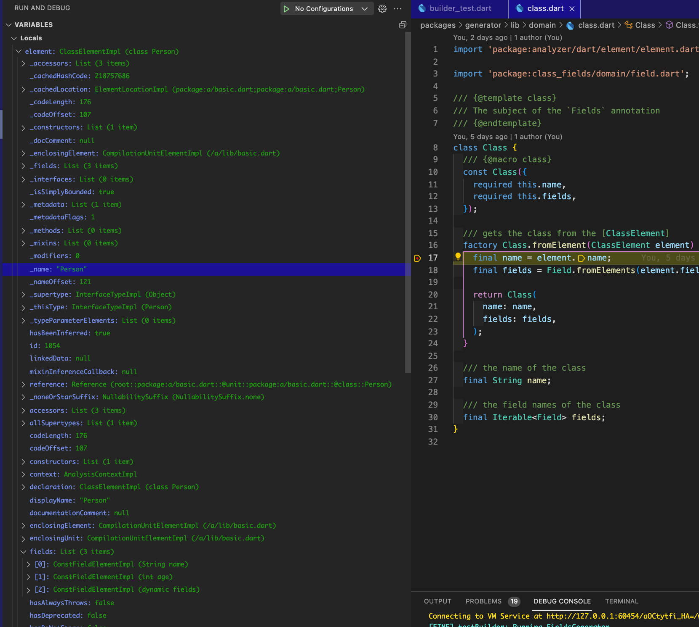

<p align="center">
<h1 align="center">Generator Test</h1>
<h3 align="center">A library to help test generators and build runner packages using dart files instead of Strings</h3>
</p>

<p align="center">
<a href="https://codecov.io/gh/mrgnhnt96/generator_test"></a>
<a href="https://pub.dev/packages/generator_test"></a>
<a href="https://github.com/mrgnhnt96/generator_test"></a>
<a href="https://pub.dev/packages/very_good_analysis"></a>
<a href="https://github.com/tenhobi/effective_dart"></a>
<a href="https://opensource.org/licenses/MIT"></a>
</p>

# Purpose

Testing generators and build_runner packages can be difficult. `generator_test` is a library aimed at making it easier to accomplish this!

# Usage

## Depend on it

Add `generator_test` to your `pubspec.yaml`

```yaml
dev_dependencies:
  generator_test: # RECENT_VERSION
```

## Use it

### Create a fixture file

A `fixture` is
> A known state which a test is running against

Meaning, you can create an "output" to compare against the generated code based on a specific input.
You can read more about it [here](fixture)

To use this package, you will create files, an input & a fixture file (aka the expected generated output).

Here is an example of what your input file could look like

```dart
part 'fixtures/example.dart';

@ClassName()
class Example {}
```

And here is an example of what your fixture file could look like

```dart
part of '../example.dart';

// **************************************************************************
// ClassNameGenerator
// **************************************************************************

// The class name is `Example`
```

The `generator_test` package will handle the files `part`s for you, whether it should be included or not, and the extension to be used based on the builder being tested.

You can provide the generator name wrapped in `*` (77 total) or you can let the package handle it for you. Like so,

```dart
// @generator=ClassNameGenerator
```

`generator_test` will use the provided name of the generator and wrap it with `*`

### Create your test

#### Generator

```dart
// create the test generator

final generator = SuccessGenerator(
      'example',
      ClassNameGenerator(),
      inputDir: 'test/fixture', // default
      fixtureDir: 'test/fixture/fixtures', // default
      compareWithFixture: true, // use `false` to validate dart code only
      fixtureFileName: ..., // used when fixture file name does not match input file name
    );
);

// run the test
generator.test();
```

#### Builder

```dart
final generator = SuccessGenerator.fromBuilder(
      'example',
      classNameBuilder, // entry point for the build_runner
      inputDir: 'test/fixture', // default
      fixtureDir: 'test/fixture/fixtures', // default
      compareWithFixture: true, // use `false` to validate dart code only
      fixtureFileName: ..., // used when fixture file name does not match input file name
      extension: ..., // retrieves from the builder ie: .g.dart
      options: ..., // config for your builder ie: {'add_comment': true}
    );

// run the test
generator.test();
```

## Debug Bonus

Debugging build_runners is not s simple task, and on top of that, the [analyzer]'s api is HUGE. It can be daunting to write build_runner packages with the amount of data you need to filter through to get the values you want.

`generator_test` makes it possible to add break points during your tests, which makes developing build_runner packages much easier!

Simply add `async/await` to your test and run in debug mode!

```dart
void main(){
  test('generates successfully', () async {
    final generator = SuccessGenerator.fromBuilder(
          'example',
          classNameBuilder,
          compareWithFixture: false, // use `false` to validate dart code
        );

    // dubug your package
    await generator.test();
  });
}
```

Find the values you're looking for!



[fixture]: https://stackoverflow.com/q/12071344/12123033
[analyzer]: https://pub.dev/packages/analyzer
